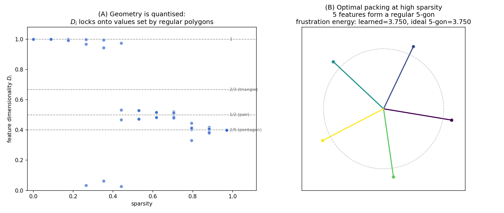
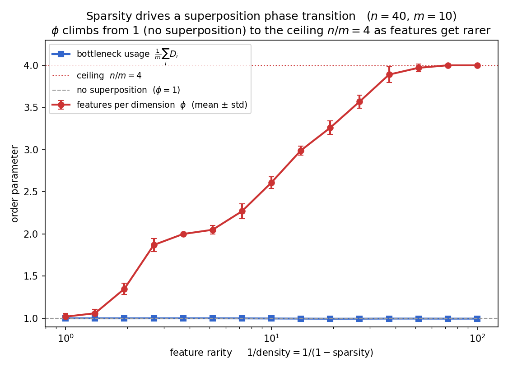

# A Toy Model of Superposition — a statistical-physics view

**How can a neural network remember more things (features) than it has room (neurons, dimensions) for? By superposition - the same way packed spheres do.**

This repository builds the smallest neural network that exhibits *superposition*, reproduces the key results from scratch, and then analyses them with the tools of statistical physics: order parameters, phase transitions, and energy minimisation. Everything runs on a laptop CPU in a few minutes.

### Based on Anthropic's "Toy Models of Superposition"

Everything here is built on **Elhage et al. (2022), *Toy Models of Superposition*** (Transformer Circuits Thread, <https://transformer-circuits.pub/2022/toy_model/index.html>). The model, the feature-dimensionality metric, the quantized polytope geometry, and the phase-change picture all originate in that work. This repository is an independent reimplementation of its core, re-examined through a statistical-mechanics lens.

### Scope

A compact, self-contained reproduction of the paper's *core* results plus an explicit statistical-physics analysis — deliberately narrow, not a full replication.

- **Reproduced from scratch** — the ReLU output model; the emergence of superposition with sparsity ($n=5$, $m=2 \to$ pentagon); the feature-dimensionality metric and its quantized values; the $n=2,m=1$ phase-change analysis; and the paper's reading of the geometry as a **generalized Thomson problem** (the paper makes this connection explicitly — see §3).
- **Added** — an independent, tested reimplementation; a numerical check that the learned geometry attains the ideal packing energy exactly; and a features-per-dimension order parameter that tracks the superposition phase transition. These illustrate and extend the paper's framing; they do not originate it.
- **Out of scope** — results that are in the paper but not attempted here: the linear-model contrast, computation-in-superposition, correlated/anti-correlated features, higher-dimensional polytopes, learning dynamics, and the connection to real trained networks.

---

## 1. Abstract

A neural network stores information inside a fixed number of internal "slots" (think of them as the axes of a coordinate system). Common sense says it can store at most one piece of information per slot. **Superposition** is the surprising trick where a network stores *many more* pieces of information than it has slots, by laying them down as *overlapping* directions that share the slots. This works only because the information is **sparse** — most pieces are "silent" at any given moment, so the overlaps rarely cause confusion. Below we watch a network discover this trick on its own, and we show that the shapes it settles into are exactly the shapes a physicist would predict from an energy-minimization argument.

### A few terms, defined once

- **Feature**: one independent piece of information the network might want to represent (e.g. "the image contains a wheel"). We use *n* features.
- **Dimension / slot**: one axis of the network's internal storage space. We use *m* of them, with **m < n** — fewer slots than features. That scarcity is the whole point.
- **Sparsity**: the fraction of the time a feature is *off* (exactly zero). Sparsity 0 = every feature is always on ("dense" world); sparsity near 1 = features almost never appear together ("sparse" world). This is our master control knob.
- **Superposition**: storing more features than dimensions by using overlapping, non-perpendicular directions.

---

## 2. Motivation — why superposition is worth understanding

Modern language models almost certainly rely on superposition heavily: they represent far more concepts than they have neurons. That makes it a central obstacle for **interpretability** (the effort to understand what a network has actually learned), because a single neuron ends up entangled in many unrelated concepts. A toy system small enough to solve completely is the natural place to build intuition before tackling it in real networks.

---

## 3. Why this is really a physics problem

If you must place *n* feature directions in only *m* dimensions, they cannot all be mutually perpendicular — there isn't enough room. So they interfere. Each pair of features that points in similar directions pays a penalty (they get confused for one another). The network wants to arrange the directions to make the *total* penalty as small as possible.

That is a **frustration problem**, and physicists have studied its cousins for over a century:

- It is the **Thomson problem**: place electrons on a sphere so that their mutual repulsion is minimized. The solutions are beautiful regular shapes.
- It is **sphere packing** and **spin frustration**: many parts, each wanting to avoid the others, settling into an ordered compromise.

And because we have a control knob (sparsity), we can ask the question at the heart of statistical mechanics: **does the system change phase as we turn the knob?** It does — sharply — and the ordered phases are regular polygons.

This is home territory for a statistical physicist — frustration, packing, and phase transitions are everyday tools there — and the rest of this repository applies them to superposition directly.

The original paper already does this — it has a section on *phase changes*, decomposes the model into competing "feature benefit" and "interference" forces, and states explicitly that the model "can be understood as solving a generalized version of the **Thomson problem**" (packing points on a sphere to minimize an interference energy). This repo doesn't originate that framing; it **reproduces it from scratch and verifies it quantitatively** — sweeping a single order parameter across a control parameter (Section 5) and confirming the learned geometry hits the ideal packing energy to numerical precision.

---

## 4. The model

The network is a deliberately minimal **autoencoder** (a network trained to copy its input to its output through a narrow bottleneck). It compresses $n$ features into $m  \lt  n$ dimensions and tries to reconstruct them:

```math
h = W x \in \mathbb{R}^{m}, \qquad \hat{x} = \mathrm{ReLU}\!\left(W^{\top} h + b\right) = \mathrm{ReLU}\!\left(W^{\top} W x + b\right). \quad (1)
```

Here $W \in \mathbb{R}^{m \times n}$ is a single weight matrix, $b \in \mathbb{R}^{n}$ a bias, and $\mathrm{ReLU}(z) = \max(0, z)$ applied elementwise. **Column $i$ of $W$, written $W_i \in \mathbb{R}^{m}$, is the direction the network uses to store feature $i$** — its *representation vector*. The ReLU is what lets the network clip away the small interference from overlapping features.

**The data (the sparse world).** Each example $x \in \mathbb{R}^{n}$ has independent features; feature $i$ is off with probability $S$ (the sparsity) and otherwise uniform on $[0,1)$:

```math
x_i = \begin{cases} 0 & \text{with probability } S, \\ u_i,\ \ u_i \sim \mathcal{U}[0,1) & \text{with probability } 1-S. \end{cases} \quad (2)
```

We call $p \equiv 1 - S$ the **density** (the probability a feature is on). The model never sees a fixed dataset — it learns the *statistics* of this world.

**The loss.** An importance-weighted mean squared reconstruction error, with optional per-feature importances $I_i$ (we use a geometric decay $I_i = r^{i-1}$, or $r=1$ for uniform), averaged over random inputs $x$:

```math
L = \mathbb{E}_{x}\left[\, \sum_{i=1}^{n} I_i \,\bigl(x_i - \hat{x}_i\bigr)^2 \right]. \quad (3)
```

The full engine is ~200 lines in [`src/superposition/`](src/superposition).

---

## 5. Results

### Experiment 1 — superposition emerges as the world gets sparser

`python experiments/01_superposition_emergence.py`

We use the tiniest interesting model: **n = 5 features, m = 2 dimensions**, importance decay $r = 0.9$, so we can *draw* the storage space on a flat page. Each arrow is one feature's representation vector. The bars below show each feature's **dimensionality** $D_i$ (Elhage et al.) — how many of the $m$ dimensions feature $i$ effectively occupies, with $\hat{W}_i = W_i / \| W_i \|$:

```math
D_i = \frac{\| W_i \|^2}{\sum_{j=1}^{n} \bigl(\hat{W}_i \cdot W_j\bigr)^2}. \quad (4)
```

It runs from $D_i = 0$ (feature not represented) to $D_i = 1$ (feature owns a full dimension), and satisfies $\sum_i D_i \le m$ — there are only $m$ dimensions to share.


- **Dense world (sparsity 0):** the network can only afford **2** of the 5 features and stores them on **perpendicular axes** — no overlap, no superposition. The other three features are dropped.
- **As sparsity rises:** the network squeezes in more features. At intermediate sparsity it stores **4** features as two perpendicular pairs (a "plus" sign).
- **Sparse world (sparsity ≈ 0.97):** it stores **all 5** features as a perfect **regular pentagon**. The directions overlap, but since features rarely co-occur, the overlap rarely costs anything.

This is the canonical "Toy Models of Superposition" result, reproduced from scratch.

### Experiment 2 — the geometry is quantized, and it solves a packing problem

`python experiments/02_feature_geometry.py`

Staying with the $n = 5, m = 2$ model ($r = 0.9$), we sweep sparsity finely and look at the *geometry* of the stored features.



**(A) Quantised geometry.** Recall the feature dimensionality $D_i$ from Eq (4). For $k$ unit vectors arranged as a **regular polygon** in 2D ($m=2$), every pairwise angle is a multiple of $2\pi/k$, so the denominator of $D_i$ collapses to a clean value (derived in the Appendix), giving

```math
D_i = \frac{2}{k}. \quad (5)
```

So the dimensionality does not drift smoothly — it **locks onto a discrete ladder** $2/k$, each value a specific shape:

| $D_i$ | $k$ | Shape the features form |
|---|---|---|
| $1$   | 1 | a feature alone on its own axis |
| $2/3$ | 3 | three features at 120° (a triangle) |
| $1/2$ | 4 | two features back-to-back (a pair) |
| $2/5$ | 5 | five features at 72° (a pentagon) |

The flat plateaus separated by jumps are the signature of distinct **geometric phases** — like discrete energy levels in a physical system. (The $2/3$ line is drawn for reference; this particular model jumps past it.)

**(B) A solved packing problem.** The paper identifies the model's *interference* term as a **generalized Thomson energy** — points packed on a sphere minimizing a repulsion. We make that concrete and measure it: the total squared overlap between *unit* feature directions,

```math
E(W) = \sum_{i \lt j} \bigl(\hat{W}_i \cdot \hat{W}_j\bigr)^2. \quad (6)
```

For $k$ unit vectors equally spaced on the circle, this has the closed form $E_k = \tfrac{1}{4}k(k-2)$ for $k \ge 3$ (derived in the Appendix). For the pentagon, $E_5 = \tfrac{1}{4}\cdot 5 \cdot 3 = 3.75$. Comparing the trained network to this ideal:

> **learned energy = 3.750, ideal regular-pentagon energy = 3.750** — they match to numerical precision.

The network, simply by minimizing reconstruction error, has independently found the minimum-energy packing — the same flavour of answer the Thomson problem gives for points repelling on a sphere.

**How feature importance enters.** That clean match is the *uniform-importance* case. In general the interference the loss penalises is importance-weighted: feature $i$'s reconstruction error carries weight $I_i$, so a collision with feature $j$ contributes $I_i(\hat{W}_i\cdot\hat{W}_j)^2$, and summed over each pair the energy is

```math
E_I(W) = \sum_{i \lt j} (I_i + I_j)\,(\hat{W}_i \cdot \hat{W}_j)^2 . \quad (7)
```

Setting all $I_i = 1$ recovers $E_I = 2E$ — exactly the regime in which the paper states the model solves a *generalized Thomson problem*. So importance does two things: it sets **which** features are stored (the benefit of storing feature $k$ is $\propto I_k$ — this is what drives the Experiment 3 count), and with non-uniform importance the minimum-energy polytopes **deform**:

| sparsity | $r$ | features stored | $E$ | $E_I$ |
|---|---|---|---|---|
| 0.97 | 1.0 (uniform) | 5 — regular **pentagon** | 3.750 | 7.500 |
| 0.97 | 0.9 | 5 — pentagon | 3.750 | 6.143 |
| 0.97 | 0.5 | 4 — regular **square** | 2.000 | 1.875 |

At $r=0.5$ the least-important feature ($I_5 \approx 0.06$) is dropped — pentagon → square. But at high sparsity the survivors stay near-regular (each $D_i$ within ${\sim}0.005$ of $2/k$), which is why the unweighted match above holds even though this run uses $r = 0.9$.

### Experiment 3 — a sparsity phase diagram

`python experiments/03_phase_diagram.py`

Now a bigger model (**n = 40 features, m = 10 dimensions**, importance decay $r = 0.95$). We pick an **order parameter** — a single number summarising the macroscopic state — and sweep the sparsity knob. Our order parameter is **features-per-dimension** $\phi$: the number of features actually stored (those with a non-negligible representation vector, $\| W_i \| \gt \tau$ with $\tau = 0.5$) divided by the number of dimensions $m$:

```math
\phi = \frac{1}{m} \sum_{i=1}^{n} \mathbf{1}\!\left[\, \| W_i \| \gt \tau \,\right]. \quad (8)
```

$\phi = 1$ means "no superposition" (each stored feature owns a dimension); $\phi \gt 1$ means superposition. The threshold $\tau$ is unambiguous because the learned norms are **bimodal** — stored features sit near $\| W_i \| \approx 1$, dropped ones near $0$ — so any $\tau$ in the gap (≈ 0.3–0.7) gives the same count; we use $\tau = 0.5$. (We also track **bottleneck usage** $\tfrac{1}{m}\sum_i D_i$, the fraction of representational capacity in use, plotted alongside it.)

Because a single run gives only a coarse integer count, we **average $\phi$ over 10 independent seeds** per sparsity (a disorder average) and plot the mean with its standard deviation, with sparsities spaced logarithmically in $1/\text{density}$ to resolve the sparse regime.



The network sits in a **no-superposition phase** ($\phi \approx 1$) in the dense world, then crosses into a **superposition phase** as the world gets sparse, climbing toward the ceiling $n/m = 4$ where every dimension is shared among four features. This is structurally a magnet ordering as temperature drops: an order parameter responding to a control parameter.

A telling detail: **bottleneck usage stays pinned at 1 throughout** while $\phi$ climbs. The $m$ dimensions are *always* fully used; sparsity changes only *how many features share them*. The climb is gradual — the rarer features are, the more get packed in — and the most superposition lives in the sparsest regime. (The minimal version of this benefit-vs-interference competition, solved exactly in closed form, is **Experiment 4**.)

### Experiment 4 — the minimal model, with analytical results

`python experiments/04_phase_diagram_n2m1.py`

The smallest model that still has a phase change is $n=2$ features in $m=1$ dimension. It is simple enough to solve in closed form, reproducing the paper's "toy model of the toy model." The first feature has importance $I_1 = 1$ and the second ("extra") feature has relative importance $I_2 = I$; each is on with probability $p = 1-S$ at value $\sim\mathcal{U}[0,1)$. With $W=(w_1,w_2)$, $h=w_1 x_1 + w_2 x_2$, and bias $b=0$, there are **three** natural ways to use the single dimension (the paper's three configurations):

- **not represented**, $W=(1,0)$ — keep feature 1, drop the extra: $\hat{x}_1=x_1$, $\hat{x}_2=0$;
- **dedicated**, $W=(0,1)$ — give the dimension to the extra, drop feature 1: $\hat{x}_2=x_2$, $\hat{x}_1=0$;
- **antipodal**, $W=(1,-1)$ — both in superposition: $\hat{x}_i=\mathrm{ReLU}(\pm h)$, exact *unless both fire*.

**Costs.** A *dropped* feature is best reconstructed by a constant — the model sets the bias to the feature's mean $\mathbb{E}[x]=p/2$ — so its cost is its **variance** $\mathrm{Var}(x)=\tfrac{p}{3}-\tfrac{p^2}{4}$ (not the raw second moment $\mathbb{E}[x^2]=p/3$; getting this right is what makes the boundary come out correctly). The *antipodal* pair reconstructs each feature exactly unless **both** fire (probability $p^2$); when they do, each feature's error is $\min(x_1,x_2)$ — the smaller of the two active values, each an independent draw from $\mathcal{U}[0,1)$ — and $\mathbb{E}[\min(x_1,x_2)^2]=\tfrac16$. Hence

```math
L_{\text{not}} = I\!\left(\tfrac{p}{3}-\tfrac{p^2}{4}\right), \qquad L_{\text{ded}} = \tfrac{p}{3}-\tfrac{p^2}{4}, \qquad L_{\text{anti}} = \frac{(1+I)\,p^2}{6}. \quad (9)
```

**Mechanism.** The interference cost is *exactly* quadratic in density (it is paid only on a collision, probability $p^2$), whereas the drop cost is the variance $\tfrac{p}{3}-\tfrac{p^2}{4}$, which is linear in $p$ **only at high sparsity**. So to leading order as $p\to0$:

```math
\underbrace{\text{drop cost} \;\sim\; p}_{\text{linear (small } p)} \quad\text{vs.}\quad \underbrace{\text{interference} \;=\; \tfrac{(1+I)\,p^2}{6}}_{\text{exactly quadratic}}. \quad (10)
```

So superposition wins once the world is sparse enough. The model takes the minimum of the three; equating $L_{\text{anti}}$ with the cheaper drop gives the superposition boundary

```math
\text{superpose} \iff p \;\lt\; p^\star, \qquad p^\star = \frac{4I}{2+5I}\ (I\le1), \quad \frac{4}{5+2I}\ (I\ge1). \quad (11)
```

These three phases tile the $(I,p)$ plane and meet at $(I,p)=(1,\tfrac47)$: **not represented** when the extra feature is unimportant and dense ($I\lt1$, $p\gt p^\star$); **dedicated** when it is the *more* important one and dense ($I\gt1$, $p\gt p^\star$); **superposition** whenever sparse ($p\lt p^\star$). The transition is **first order** (the optimal configuration switches discontinuously). The symmetric case is *not* "superposition for all sparsity": even at $I=1$ there is a genuine dense phase. Training the actual $n=2,m=1$ model confirms this three-phase map:


Coloured cells are the trained model's phase across the $(I, p)$ plane; the solid curve is the analytic boundary $p^\star(I)$ and the dashed line ($I=1$) splits the two dense phases.

**The gap near the peak.** The trained superposition region sits slightly *above* the curve, with the largest gap around $I\approx1$ (where $p^\star$ is highest). This is not a structural error — it comes from two **simplifications in the closed form**, both in the *superposition* cost $L_{\text{anti}}=(1+I)p^2/6$:

- **zero output bias** — the trained model learns a *positive* bias that grows with density (we measured it climbing from $+0.07$ to $+0.31$ as $p:0.45\to0.68$), lifting the both-active reconstruction that the antipodal solution otherwise systematically under-shoots;
- **unit, fixed weights** — the trained model *shrinks* $\| W_i \|$ as density rises (we measured $0.98\to0.77$), attenuating the interference term.

Together these put the true superposition loss roughly $2.5\times$ below the $b=0$ estimate at the boundary. (The *drop* costs, by contrast, are exact — a dropped feature is optimally predicted by its mean.) Both tricks only pay off when collisions are frequent, i.e. at high density, so they buy almost nothing at the sparse wings — where the curve hugs the cells — and the most near $I=1$, where the boundary sits at the highest $p$. The clean $p^\star$ is therefore a **conservative lower bound** on the superposition region; recovering the exact boundary means optimising the bias and scale too, which is the paper's full computation.

---

## 6. Run it yourself

```bash
git clone <this-repo>
cd Superposition
pip install -e .            # installs torch, numpy, matplotlib
python experiments/01_superposition_emergence.py
python experiments/02_feature_geometry.py
python experiments/03_phase_diagram.py
python experiments/04_phase_diagram_n2m1.py
pytest                      # fast sanity tests
```

Figures are written to [`figures/`](figures). Everything runs on CPU in a few minutes.

## 7. Repository layout

```
src/superposition/
  data.py      sparse synthetic features (the "world")
  model.py     the toy autoencoder
  train.py     training loop + config
  metrics.py   order parameters: dimensionality, frustration energy
  viz.py       plotting helpers
experiments/   four scripts, each producing one figure above
tests/         fast checks of the engine and metrics
```

## 8. Appendix — the regular-polygon identities

The two closed forms used in Experiment 2. For $k$ unit vectors equally spaced on the circle, write $\hat{W}_a = (\cos\theta_a, \sin\theta_a)$ with $\theta_a = 2\pi a / k$, so that $\hat{W}_a \cdot \hat{W}_b = \cos\!\big(\tfrac{2\pi (a-b)}{k}\big)$. The one fact we need is that for $k \ge 3$ the cross term vanishes and

```math
\sum_{d=0}^{k-1} \cos^2\!\Big(\tfrac{2\pi d}{k}\Big) = \frac{k}{2}. \quad (12)
```

**Dimensionality** $D_i = 2/k$ (Eq 5). With unit vectors $\| W_i \| = 1$, the denominator of $D_i$ is exactly the sum above, so

```math
\sum_{j} \bigl(\hat{W}_i \cdot W_j\bigr)^2 = \sum_{d=0}^{k-1} \cos^2\!\Big(\tfrac{2\pi d}{k}\Big) = \frac{k}{2} \quad\Longrightarrow\quad D_i = \frac{1}{k/2} = \frac{2}{k}. \quad (13)
```

**Frustration energy** $E_k = \tfrac14 k(k-2)$ (Eq 6). Summing over unordered pairs, with $k$ ordered pairs for each nonzero difference $d$,

```math
E_k = \sum_{a \lt b} \cos^2\!\Big(\tfrac{2\pi (a-b)}{k}\Big) = \frac{k}{2}\sum_{d=1}^{k-1}\cos^2\!\Big(\tfrac{2\pi d}{k}\Big) = \frac{k}{2}\Big(\frac{k}{2} - 1\Big) = \frac{k(k-2)}{4}. \quad (14)
```

For the pentagon $E_5 = \tfrac14 \cdot 5 \cdot 3 = 3.75$ (an antipodal pair, $k=2$, gives $E = 1$ separately).

## 9. References

- Elhage et al., **"Toy Models of Superposition"**, Anthropic / Transformer Circuits Thread, 2022. <https://transformer-circuits.pub/2022/toy_model/index.html>
- J. J. Thomson (1904) and the long line of work on minimum-energy point configurations on the sphere (the Thomson / Tammes problems).

---

*Built as a research demonstration. The model, the dimensionality metric, the quantized geometry, the $n=2,m=1$ phase-change analysis, and the generalized-Thomson-problem reading of the geometry are all from the original paper — this repo reproduces them from scratch. What I add is an independent reimplementation, a numerical verification that the learned geometry attains the ideal packing energy exactly, and a features-per-dimension order parameter for the phase transition. The physics framing is the paper's; my contribution is reproducing and quantitatively checking it, not originating it.*
